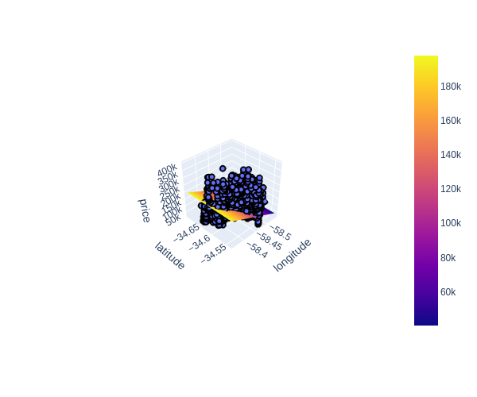
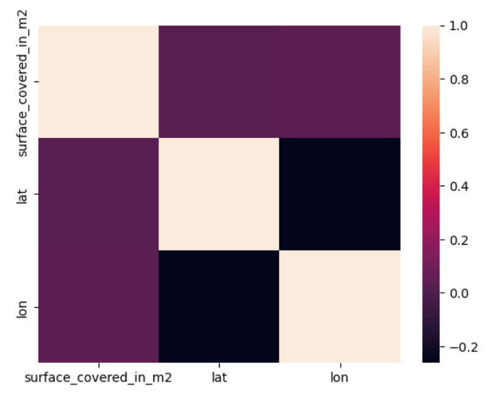
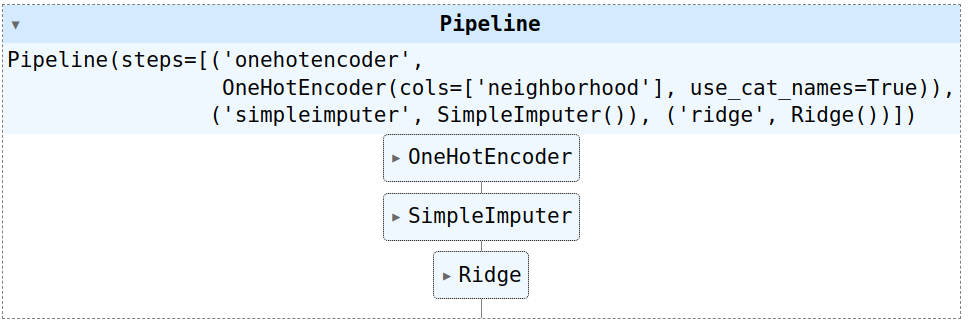
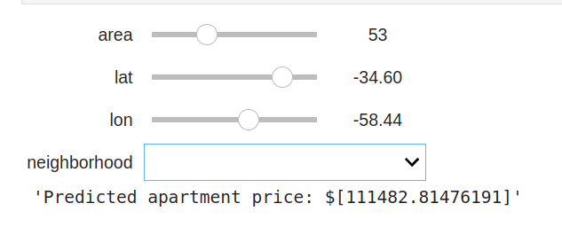

# Predict the sale prices of apartments in Buenos Aires! 🇦🇷

Welcome👋, in this project focused on Predicting Apartment Sale Prices in Buenos Aires! Our endeavor aims to develop predictive models for estimating apartment sale prices in the bustling city of Buenos Aires. With a commitment to rigorous analysis and methodical modeling, we seek to provide accurate forecasts that contribute to informed decision-making within the real estate market of this dynamic city. Join us as we delve into the complexities of real estate data and strive to offer valuable insights for strategic planning and investment.🚀 

## Project Overview 

#### **Create a linear regression model using the scikit-learn library**🔍📈🔧

#### **Build a data pipeline for imputing missing values and encoding categorical features**🛠️📊🔌

#### **Improve model performance by reducing overfitting**📈🔧🔍

#### **Create a dynamic dashboard for interacting with our completed model**📊🖥️🔧

## Key insghits 

#### 3d scatter Plot : 
**Distribution of Prices based on (lan,long)**

#### correlation heatmap plot :
**coorelation of (lan,long,surface)**

#### pipeline model : 
**including (oneHotEncoder,SimpleImputer,Ridge)**

#### Deploy the model in widget : 
**predict the price based on (Size,Location,Neighborhood)**

## Next Steps

I'm looking forward to tackling the next challenge, Project 3 Air Quality in in Nairobi !

## Ask Me 

Feel free to reach out if you have any questions or suggestions for improvement. Thank you for visiting my repository!

